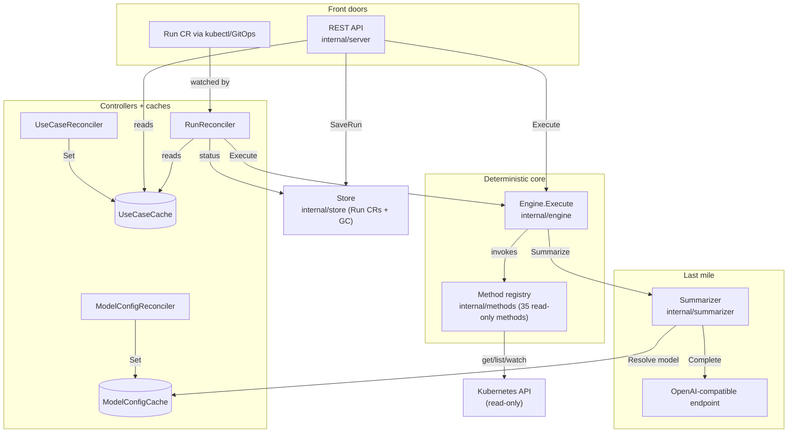

# kato Architecture

This document describes how kato is built: its components, how a run flows through
them, and the design invariants that hold the system together. For *what* kato is and
why, see [`README.md`](README.md); for the method catalog, see
[`docs/METHOD.md`](docs/METHOD.md); for local development, see
[`DEVELOPMENT.md`](DEVELOPMENT.md).

## Core idea

kato turns a team's troubleshooting runbook into a versioned Kubernetes object and
executes it deterministically. A `UseCase` CRD declares an ordered list of read-only
checks; running it always executes the same checks in the same order. An LLM is used
only at the very end, to summarize the collected evidence into a human-readable
diagnosis. Three properties fall out of this and drive every design decision:

- **The flow is deterministic, the model is not.** The engine — not the LLM — decides
  what to inspect. The LLM never calls the Kubernetes API and never chooses a step.
- **Read-only by construction.** The operator ships a `get/list/watch`-only
  ClusterRole. The only writes it can make are to its own CRD status subresources and
  to `Run` records in its own namespace.
- **Auditable.** Every execution is persisted as a `Run` CRD: the inputs, each step's
  outputs, and the summary. A run can be read back exactly as it happened.

## Component map

The center of the system is a single function, `engine.Engine.Execute`. Both front
doors — the REST API and the `Run`-CR controller — call it with the same signature, so
an API-triggered run and a GitOps-triggered run execute identically. Everything else is
either feeding that function (caches, config, clients) or recording its result (store).

## The three CRDs

kato defines three cluster/namespaced custom resources in
[`api/v1alpha1`](api/v1alpha1). All deepcopy code is generated (`make generate`) and the
CRD schemas are generated (`make manifests`).

| CRD | Scope | Role |
|---|---|---|
| **`UseCase`** | Cluster | The flow: `inputs`, ordered `steps` (each a method call with `when`/`with`/`forEach`/`summaryFilter`), and a `summary` prompt + optional `modelConfigRef`. |
| **`ModelConfig`** | Cluster | An OpenAI-compatible LLM backend: `baseURL`, `model`, `maxTokens`, `temperature`, optional API-key `Secret` ref, and a `default` flag. |
| **`Run`** | Namespaced | The audit record of one execution: `spec` (useCase + inputs) and `status` (phase, per-step outputs, summary, timing). |

### UseCase inputs and defaults

An input is declared as `InputDecl{Name, Type, Required, Default}` (v1 supports
`type: string` only). Inputs flow through the engine as a single `map[string]string`.
Resolution happens once, in `resolveInputs`, at the top of `Execute`:

1. Caller provided the input → the caller's value wins (even an empty string).
2. Omitted and `Default != ""` → the default fills it (a default satisfies `required`).
3. Omitted, no default, `required: true` → `InputError` (`missing required input`).
4. Omitted, no default, not required → the input stays absent.
5. A caller key that no input declares → `InputError` (`unknown input`).

Because the effective map is materialized at this single seam, every downstream
`$(inputs.X)` lookup — in `when`, `with`, and `forEach` — resolves defaults
automatically. Note the deliberate limitation: an **empty default means "no default"**,
so you cannot default an input to the empty string.

## Two execution paths, one engine

### REST path (`internal/server`)

`POST /api/v1/usecases/{name}/run` looks up the UseCase in the cache, rejects it if it
is not `Ready`, acquires a non-blocking concurrency slot (`429` if full), calls
`Execute`, and persists the result with `store.SaveRun`. An `engine.InputError` maps to
HTTP `400`; a successful run returns the phase, summary, and (unless
`?includeOutputs=false`) the step outputs. The `Run` it writes is labeled
`kato.zufardhiyaulhaq.com/managed-by: api` so the controller never re-executes it.

Other endpoints: `GET /api/v1/usecases[/{name}]`, `GET /api/v1/methods` (the live method
catalog with params/outputs), `GET /api/v1/runs[/{name}]`, and `/healthz` + `/readyz`.

### Controller path (`internal/controller`, GitOps)

A `Run` created directly with `kubectl` or GitOps (which lacks the `managed-by: api`
label) is picked up by the `RunReconciler`. It validates the referenced UseCase (exists
and Ready), **claims** the Run by writing `status.phase = Running` via optimistic
concurrency, runs `Execute`, and writes the terminal status with `store.BuildRunStatus`
— the same status builder the REST path uses, so both paths record identical structure.

The claim is the execute-once guarantee: a `status.phase != ""` early-return skips any
Run that already started or finished, and the `Status().Update` that writes `Running`
loses a `409` on a stale double-claim (then requeues and sees `Running`). API-managed
Runs are filtered twice — by a workqueue predicate and by an in-Reconcile label check.

## Components

### Entry point and wiring (`cmd/kato/main.go`)

`main` builds a controller-runtime manager and wires everything by hand. Notable
decisions live here:

- **Two Kubernetes clients.** A cache-backed client (`mgr.GetClient`) drives the
  cluster-scoped `UseCase`/`ModelConfig` watches the ClusterRole permits. A separate
  **uncached** client handles namespaced `Run` CRs and ModelConfig API-key `Secret`s —
  the cached client would set up cluster-wide LIST+WATCH informers for those types,
  which the read-only namespaced RBAC denies and which would cache every Secret in the
  cluster.
- **A read-only typed `kubernetes.Interface`** and a **metrics client** are passed to
  methods via `methods.Deps`. Constructing the metrics client never fails when
  metrics-server is absent; methods handle a nil/unavailable metrics path gracefully.
- **The manager's own metrics server is disabled** (`BindAddress: "0"`) because its
  default `:8080` collides with kato's HTTP server.
- The HTTP server and a GC/reaper loop are registered as manager `Runnable`s so they
  share its lifecycle and signal handling.

### Method library and registry (`internal/methods`)

A **method** is a read-only Kubernetes check with a small, uniform contract
(`Method` interface): `Name`, `Description`, typed `Params`, typed `OutputFields`, and
`Run(ctx, Deps, params) (Outputs, error)`. Outputs are flat and typed
(`string`/`int64`/`bool`); a method that returns a list implements the optional
`ListProducer` interface (a list output is consumable only by a `forEach` step, never by
a scalar `when`). There are **35 built-in methods** across four families:

- `check_*` — status/health reads (pods, deployments, nodes, HPAs, PDBs, endpoints, …).
- `describe_*` — fuller single-object detail (pod, deployment, node, statefulset, …).
- `list_*` — collection queries that produce list outputs for `forEach` (failing pods,
  node pods, nodes, pods).
- `probe_*` — active network traffic from kato's own pod (`probe_tcp`, `probe_http`,
  `probe_dns`, `probe_traceroute`, `probe_tls`, `probe_grpc`), routed through the
  `Prober` seam (`LocalProber` in production; a future `RemoteProber` can run probes
  from a remote cluster).

Each method self-registers in an `init()` that appends to `builtinFns`; `methods.Builtin()`
constructs a `Registry` with all of them. A `check`/`probe` **failure is a finding, not a
Go error**: the method returns `success:false` + an `error` string with a nil Go error,
and only genuine parameter mistakes return a non-nil error.

### Engine (`internal/engine`)

The engine executes a validated flow. Its pieces:

- **References** (`refs.go`): the `$(...)` mini-language. Three kinds —
  `$(inputs.<name>)`, `$(steps.<step>.<field>)`, and `$(item.<field>)` (forEach only).
  `Substitute` fills them in `with` values; an unresolvable ref fails the step.
- **`when` conditions** (`cel.go`): a `when` string is rewritten into
  [CEL](https://github.com/google/cel-go) over a **typed scope** — inputs are strings,
  prior step outputs carry their declared types. Compilation happens at UseCase
  *validation* time, so type errors and non-boolean expressions are caught before any
  run, never mid-execution.
- **Step execution** (`engine.go`): steps run in order. A step is **skipped** if a step
  it references did not complete; otherwise its `with` is substituted, params validated,
  and the method run under a per-step timeout. Outcomes are `completed` / `skipped` /
  `failed`.
- **`forEach` fan-out**: a step can iterate a prior step's list output, binding
  `$(item.<field>)` into `with`. Iterations are capped by `maxItems` (default **5**, hard
  ceiling **20**); the source list is expected worst-first, and truncation is recorded in
  a `note`. A forEach step exposes no referenceable outputs (its results are per-item).
- **Phases**: the run's phase aggregates step outcomes — `Succeeded` (no failures),
  `PartiallySucceeded` (some failed, some completed), or `Failed` (all failed).

`Execute` returns an `error` **only** for invalid inputs (`InputError` → HTTP 400).
Every step-level failure lives inside the returned `Result`, never as an error — a failed
check is evidence, not a crash.

### Summarizer (`internal/summarizer`)

The summarizer turns collected step outputs into one LLM call. It has **no tools and no
cluster access** — it only reads the outputs the engine already gathered. `BuildEvidence`
renders each step's outcome and outputs as text; the LLM gets the UseCase's summary
prompt plus that evidence, under a fixed system prompt that forbids inventing data. If
the LLM is unavailable, the run still succeeds: the deterministic result is returned with
a `warning`, never blocked on AI. `MaxEvidenceBytes` caps the prompt to guard against a
runaway ConfigMap or log dump.

### summaryFilter — one knob, two consumers

A step's `summaryFilter` is a single control with two effects: it selects which output
fields reach the **LLM** *and* which fields are persisted into the **Run** record.
`nil` (omitted) = all outputs; a non-empty list = only those keys; an empty list = none
(an audit-only step). Crucially, it does **not** affect `when`/`$(steps.x.y)`, which
always read the full in-memory outputs. This keeps a `describe_*` step's large `manifest`
out of both the model prompt and the Run unless explicitly listed.

### Store (`internal/store`)

`Store` persists each execution as a `Run` (create spec, then write status subresource)
and shares `BuildRunStatus` with the controller path. Persisted step outputs are filtered
by the same `summaryFilter`. Two background jobs run on a ticker: **GC** deletes Runs
older than `RunTTL`, and the **reaper** force-fails Runs stuck in `Running` past
`RunMaxDuration` (the signature of a controller that crashed mid-run).

### Controllers and caches (`internal/controller`)

Three reconcilers keep in-memory caches in sync and set `Ready` conditions:

- **`UseCaseReconciler`** validates each UseCase with `engine.ValidateUseCase` (unknown
  methods, bad refs, type-checked `when`, summaryFilter fields, forEach shape, …), stores
  it in the **`UseCaseCache`** with a ready flag, and writes a `Ready` condition. The
  cache is the read side for both the API server and the `RunReconciler`.
- **`ModelConfigReconciler`** syncs each ModelConfig into the **`ModelConfigCache`** and
  marks it `Ready`.
- **`RunReconciler`** executes externally-created Runs (see the controller path above),
  bounded by `MaxConcurrentReconciles`.

The `ModelConfigCache.Resolve(uc)` flow selects a model — the UseCase's `modelConfigRef`,
or the `default` ModelConfig (lexicographically-first name if several are marked default)
— parses temperature, reads the API key from a Secret if referenced, and returns a
`summarizer.Completer` bound to that endpoint plus the `LLMTimeout`. Both caches guard
state with an `RWMutex` and store deep copies.

### Config (`internal/config`)

Runtime settings come from `KATO_*` environment variables (namespace, listen address,
step timeout, Run TTL, concurrency caps, GC interval, evidence cap, LLM timeout). LLM
settings deliberately live in `ModelConfig` CRs, not here.

## Design invariants

These hold across the codebase; changing one is an architectural decision, not a local edit.

- **Determinism never depends on AI.** The engine's result is fully determined by inputs +
  cluster state. LLM failure downgrades to a `warning`, never an error.
- **Read-only by construction.** Methods only `get/list/watch`. The single choke point
  (`Deps`) carries no write-capable client.
- **Failure is a finding.** Step/probe failures are recorded outcomes; only invalid
  *inputs* produce an error out of `Execute`.
- **Execute-once for Runs.** The `status.phase` claim + label filtering guarantee a Run
  executes exactly once regardless of which path created it.
- **Single seam for inputs.** Defaults and validation happen once, in `resolveInputs`.
- **One `summaryFilter`, two consumers.** What the model sees and what the Run records are
  the same curated set.
- **Single replica by design.** kato is one process; horizontal scale-out would require
  leader election and cache warming, which are intentionally not built.

## Build, package, deploy

- **Build:** `make build` produces `bin/kato`. The Dockerfile is a two-stage build —
  `golang:1.25` compiles a static (`CGO_ENABLED=0`) binary into a
  `gcr.io/distroless/static:nonroot` image with `ENTRYPOINT ["/kato"]`.
- **Codegen:** `make generate` (deepcopy) and `make manifests` (CRD schemas via
  controller-gen v0.17.2). The CRD YAML exists in **two places** that must stay in sync —
  `config/crd/bases/` and `charts/kato/crds/` — synced by copying after `make manifests`.
- **Chart (`charts/kato`):** deploys a single-replica Deployment (readiness `/readyz`,
  liveness `/healthz`, config injected as `KATO_*` env), a Service, a ServiceAccount, and
  RBAC. The RBAC posture is the security boundary:
  - a cluster-scoped **ClusterRole** with `get/list/watch` on workload/infra resources
    (pods, nodes, deployments, jobs, HPAs, PDBs, ingresses, endpointslices, metrics, …),
    plus `update/patch` limited to kato's own CRD **status** subresources and `get` on the
    `/healthz`/`/livez` non-resource URLs (for `check_apiserver`);
  - a namespaced **Role** granting full verbs on `Run` CRs and `get` on `Secret`s, scoped
    to kato's release namespace only.
- **Module:** `github.com/zufardhiyaulhaq/kato`, Go 1.25. Key deps: controller-runtime
  v0.20.4, client-go/api/apimachinery v0.32.3, cel-go v0.23.2 (`when`), grpc v1.82.1
  (`probe_grpc`), golang.org/x/net (`probe_traceroute`). The LLM client is a hand-rolled
  OpenAI-compatible HTTP client — no vendor SDK.

## Extending kato

To add a method: create `internal/methods/<name>.go` implementing the `Method` interface
(and `ListProducer` if it returns a list), register it via an `init()` that appends to
`builtinFns`, and add a table test against the fake Kubernetes client. If it reads a new
resource type, extend the ClusterRole in `charts/kato/templates/rbac.yaml`. Document it in
`docs/METHOD.md`. The method is then automatically available to every UseCase and appears
in `GET /api/v1/methods`. No engine, server, or wiring change is required — the registry
and the typed scope pick it up for free.

## Repository layout

| Path | Responsibility |
|---|---|
| `cmd/kato/` | Entry point: manager, clients, HTTP server, GC/reaper loops, wiring. |
| `api/v1alpha1/` | The three CRDs + generated deepcopy. |
| `internal/methods/` | The 35 read-only checks, the `Method` interface, and the registry. |
| `internal/engine/` | Flow execution: `$()` refs, CEL `when`, steps, `forEach`, input resolution, validation. |
| `internal/summarizer/` | Evidence builder + OpenAI-compatible client. |
| `internal/store/` | Run persistence, TTL GC, stuck-run reaping. |
| `internal/server/` | REST API. |
| `internal/controller/` | Reconcilers, caches, ModelConfig resolution. |
| `internal/config/` | Environment-variable configuration. |
| `charts/kato/` | Helm chart: Deployment, RBAC, Service, CRDs, optional ModelConfig. |
| `examples/` | Ready-made UseCases, ModelConfigs, and Runs. |
| `docs/METHOD.md` | The method catalog. |
